# Laza Shop - Flutter E-commerce App

A modern Flutter e-commerce application for accessories shopping with a clean architecture and beautiful UI design.

## 🎥 Demo Video

https://github.com/user-attachments/assets/laza-shop-demo.mp4

> **Note:** You can find the demo video in the `screenshots/Laza_shop_demo.mp4` directory.

## 📱 App Features

### Authentication

- **Onboarding Screen** - Welcome users with an attractive introduction
- **User Registration** - Sign up with email verification
- **User Login** - Secure authentication with token management
- **Email Verification** - OTP-based email confirmation system
- **Automatic Token Refresh** - Seamless token renewal using refresh tokens for uninterrupted user sessions

### Shopping Experience

- **Home Screen** - Browse featured products and categories with infinite scroll pagination
- **Product Details** - Detailed product information and specifications
- **Product Catalog** - Comprehensive product listing and browsing
- **Shopping Cart** - Add products to cart with quantity management and price calculation
- **Infinite Scroll Pagination** - Seamless product loading as you scroll, optimized for performance and bandwidth

### Core Features

- **Responsive Design** - Optimized for different screen sizes
- **Secure Storage** - User tokens and sensitive data protection
- **Network Caching** - Optimized image loading and caching
- **Infinite Scroll Pagination** - Efficient data loading with automatic pagination for improved performance
- **Skeleton Loading (Skeletonizer)** - Beautiful shimmer loading animations throughout the app for enhanced UX during data fetching
- **Custom Splash Screen** - Branded app launch experience
- **Automatic Session Management** - Intelligent token refresh mechanism that handles expired tokens transparently

## 🏗️ Architecture & State Management

### Architecture Pattern

This project follows **Clean Architecture** principles with feature-based modular structure:

```
lib/
├── core/                     # Core functionalities
│   ├── di/                   # Dependency Injection (GetIt)
│   ├── helpers/              # Utility functions and constants
│   ├── networking/           # API services and networking
│   ├── routing/              # App navigation and routing
│   ├── themes/               # App themes and styling
│   └── widgets/              # Reusable UI components
└── features/                 # Feature modules
    ├── home/                 # Home screen functionality
    ├── login/                # Authentication login
    ├── onboarding/           # App introduction
    ├── product_details/      # Product detail views
    └── sign_up/              # User registration
```

### State Management

- **Flutter BLoC/Cubit** - Primary state management solution
- **GetIt** - Dependency injection for service locator pattern
- **Shared Preferences** - Local data persistence
- **Flutter Secure Storage** - Secure token and sensitive data storage

Each feature follows the **Data-Logic-UI** pattern:

- `data/` - Models, repositories, and API services
- `logic/` - Cubits/BLoCs for state management
- `ui/` - Screens and widgets

### Authentication & Token Management

The app implements a robust token refresh mechanism that ensures seamless user experience:

#### Automatic Token Refresh

- **Interceptor-Based**: Uses Dio interceptors to automatically detect 401 (Unauthorized) responses
- **Transparent Renewal**: Automatically refreshes expired access tokens using stored refresh tokens
- **Request Retry**: Failed requests are automatically retried with the new access token
- **Secure Storage**: Both access tokens and refresh tokens are securely stored using Flutter Secure Storage

#### Implementation Details

- **Login Flow**: On successful login, both access token and refresh token are stored securely
- **API Interceptor**: Monitors all API responses for 401 status codes
- **Token Refresh**: When a 401 is detected, the system:
  1. Retrieves the stored refresh token
  2. Calls the refresh token endpoint
  3. Updates stored tokens with new values
  4. Retries the original failed request
  5. Returns the successful response to the user

This ensures users remain logged in even when their access tokens expire, providing a smooth and uninterrupted app experience.

## 📦 Dependencies

### Core Dependencies

```yaml
# State Management
flutter_bloc: ^9.1.1 # BLoC state management
get_it: ^8.2.0 # Dependency injection

# Networking
dio: ^5.9.0 # HTTP client
retrofit: ^4.7.3 # Type-safe HTTP client
pretty_dio_logger: ^1.4.0 # Network request logging

# Code Generation
freezed: ^3.2.3 # Immutable data classes
json_serializable: ^6.11.1 # JSON serialization
build_runner: ^2.9.0 # Code generation runner

# UI & Design
flutter_screenutil: ^5.9.3 # Screen adaptation
flutter_svg: ^2.2.1 # SVG support
cached_network_image: ^3.4.1 # Image caching
skeletonizer: ^1.4.2 # Skeleton loading animations

# Storage & Security
shared_preferences: ^2.5.3 # Local storage
flutter_secure_storage: ^9.2.4 # Secure storage for tokens and refresh tokens

# Other
pinput: ^5.0.2 # OTP input field
flutter_native_splash: ^2.4.6 # Native splash screen
cupertino_icons: ^1.0.8 # iOS-style icons
```

### Development Dependencies

```yaml
flutter_test: sdk # Testing framework
flutter_lints: ^5.0.0 # Linting rules
flutter_launcher_icons: ^0.14.4 # App icon generation
```

## 🚀 Getting Started

### Prerequisites

- Flutter SDK (3.9.0 or higher)
- Dart SDK
- Android Studio / VS Code
- Android SDK / Xcode (for iOS)

### Installation

1. **Clone the repository**

   ```bash
   git clone <repository-url>
   cd laza_shop
   ```

2. **Install dependencies**

   ```bash
   flutter pub get
   ```

3. **Generate code**

   ```bash
   flutter packages pub run build_runner build
   ```

4. **Run the app**
   ```bash
   flutter run
   ```

### Build Configuration

The app includes configuration for:

- **Custom App Icon** - Located in `assets/images/logo.png`
- **Adaptive Icons** - Android adaptive icon support
- **Splash Screen** - Native splash screen configuration

## 📱 Screenshots

### App Launch & Onboarding

#### Light Mode & Dark Mode

<div align="center">
  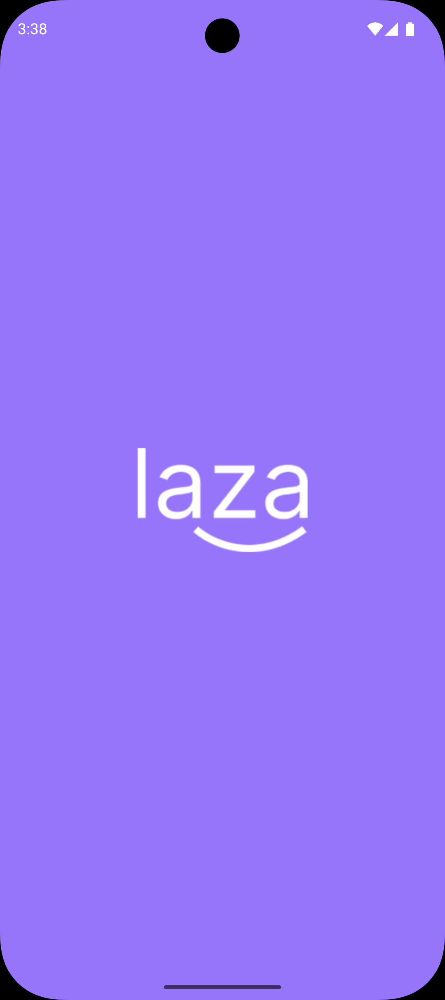
  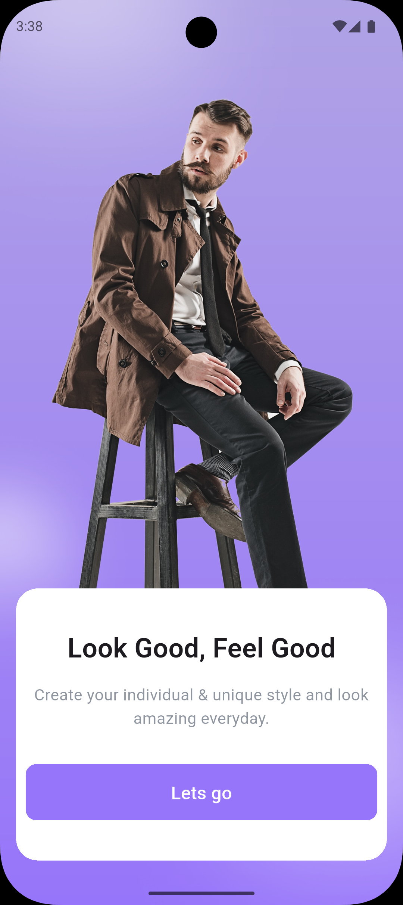
  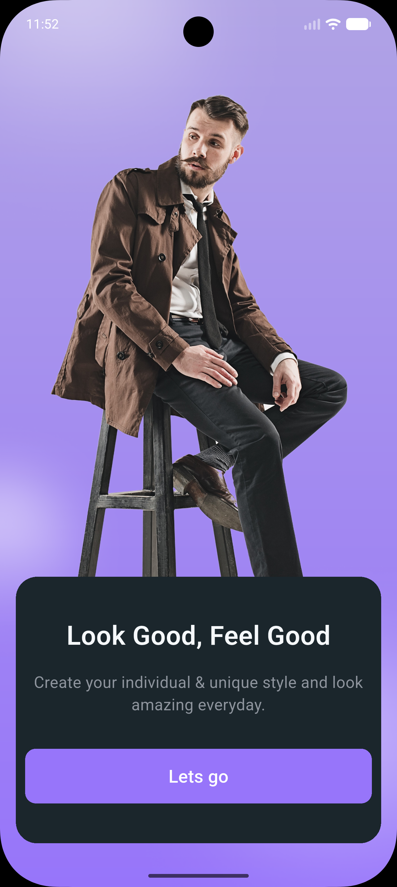
</div>

### Authentication Flow

#### Light Mode

<div align="center">
  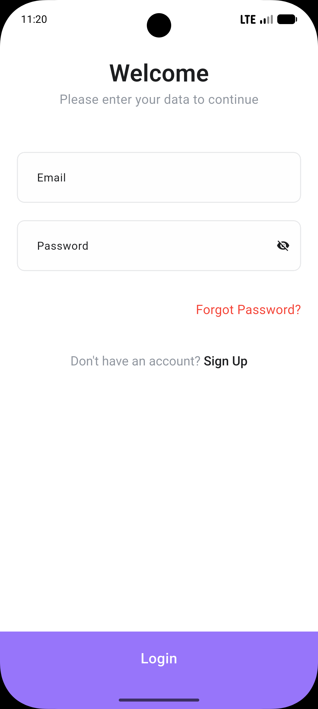
  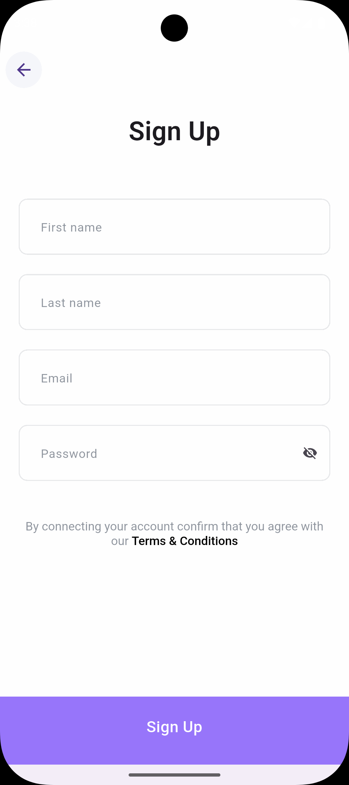
  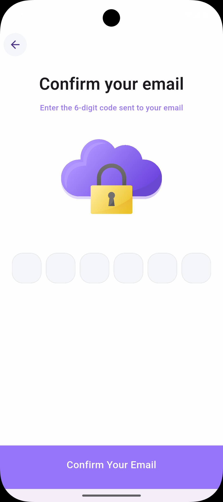
</div>

<div align="center">
  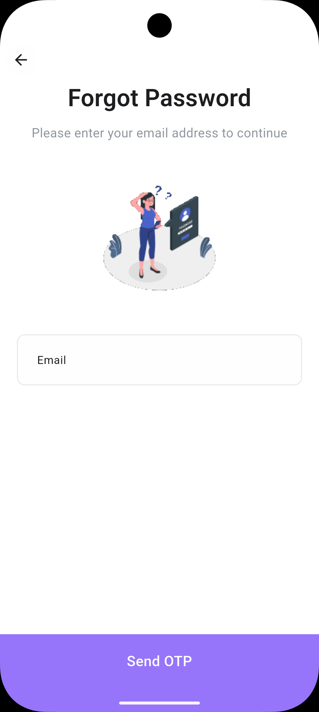
  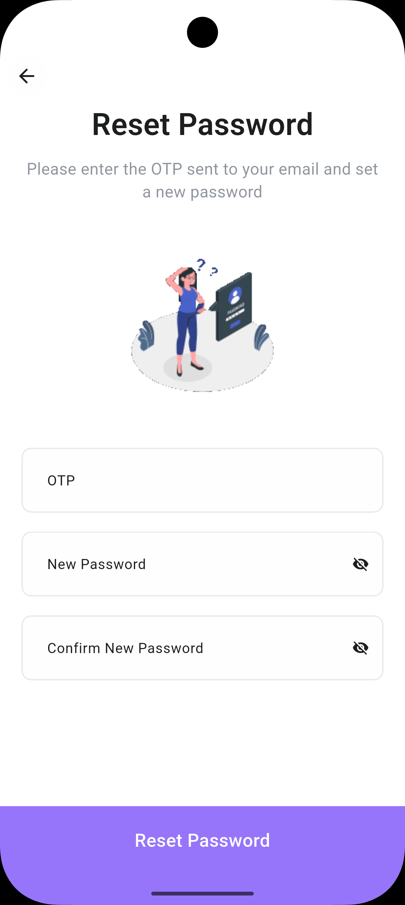
</div>

#### Dark Mode

<div align="center">
  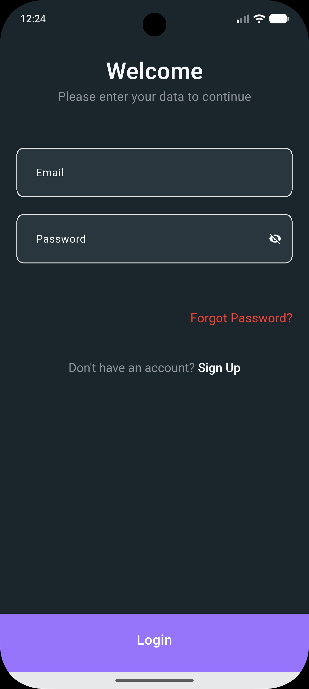
  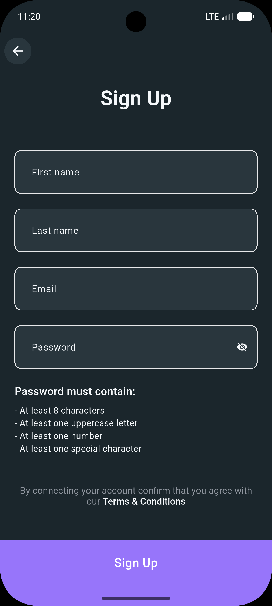
  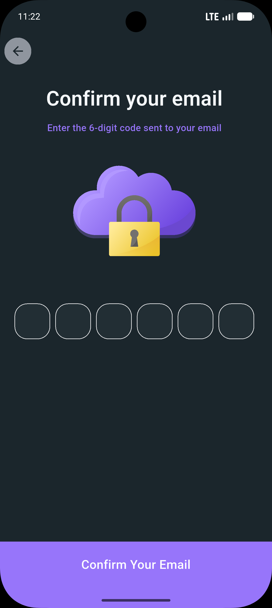
</div>

<div align="center">
  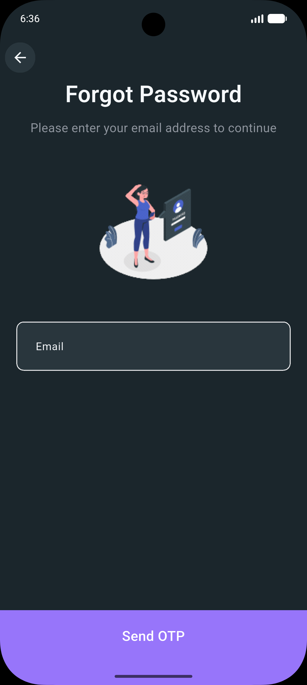
  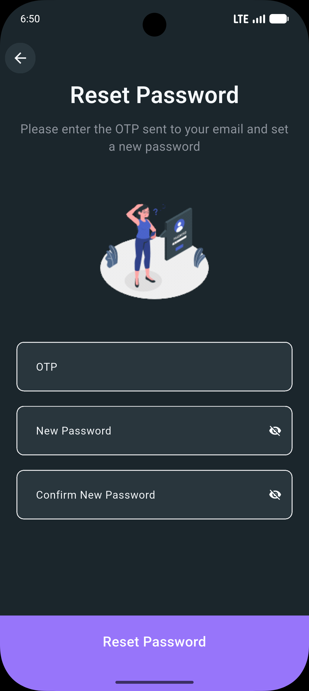
</div>

### Shopping Experience

#### Light Mode

<div align="center">
  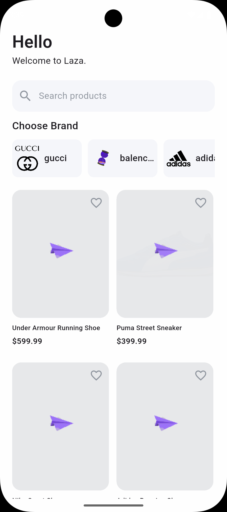
  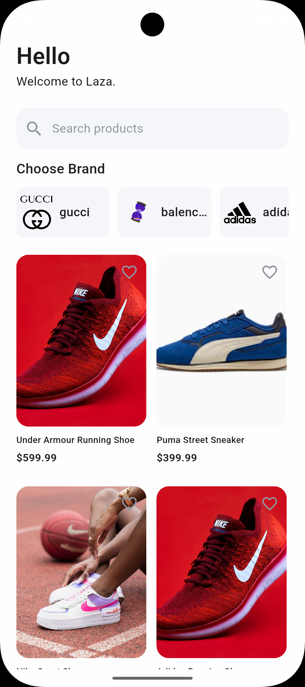
  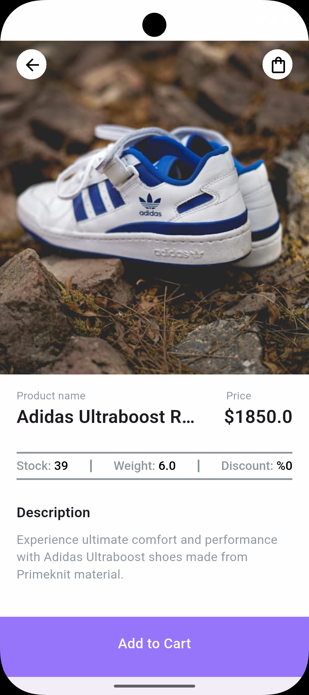
</div>

<div align="center">
  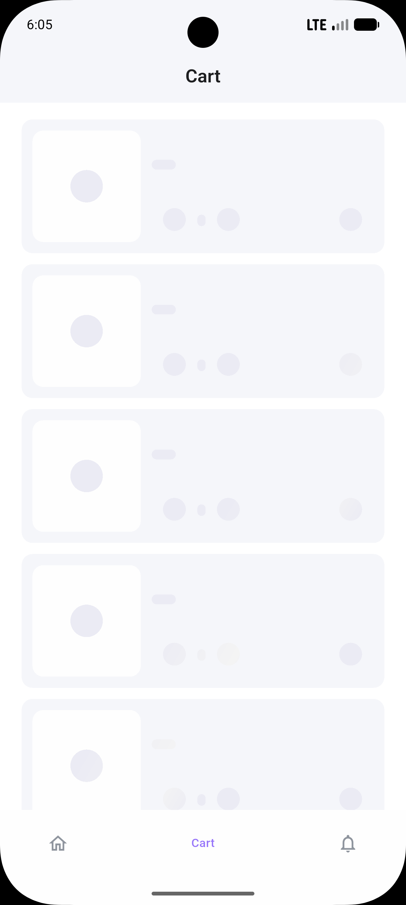
  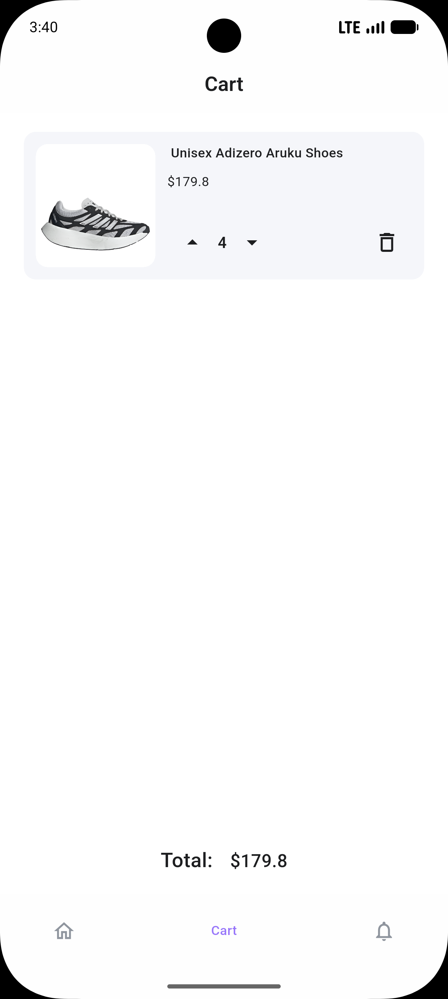
</div>

#### Dark Mode

<div align="center">
  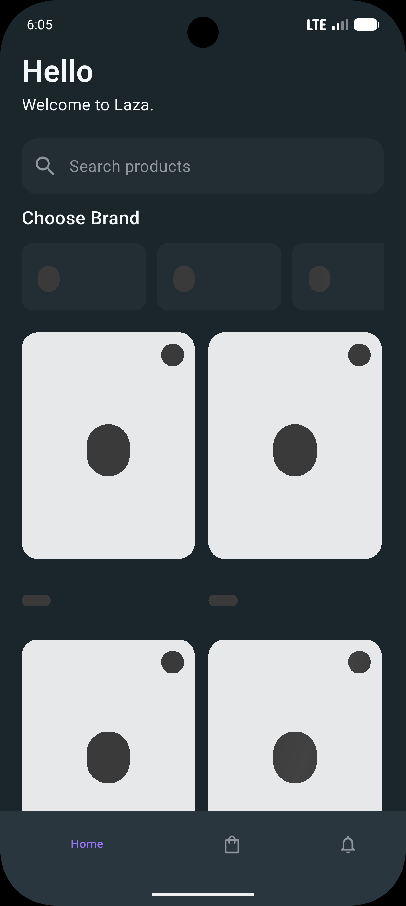
  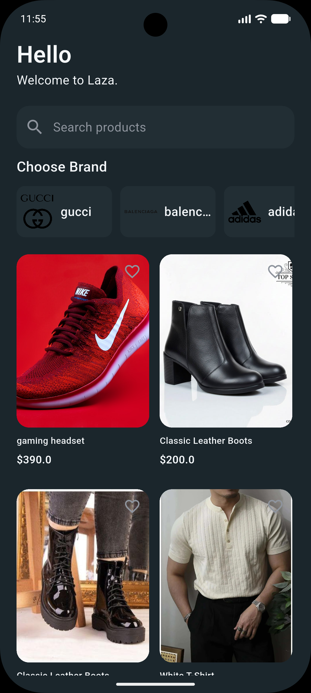
  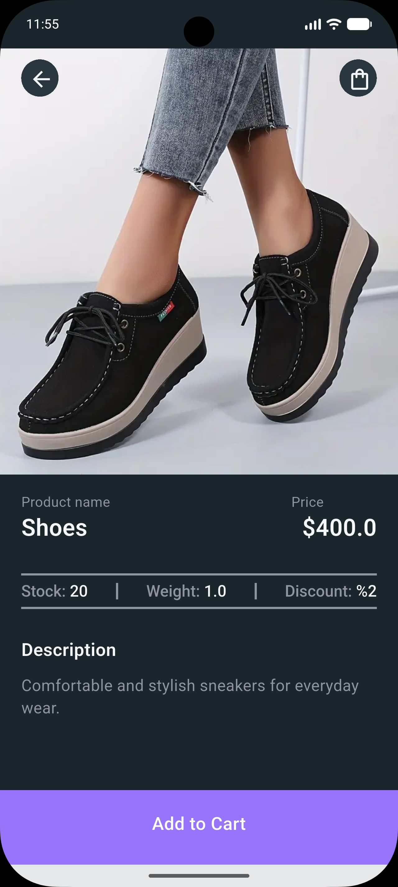
</div>

<div align="center">
  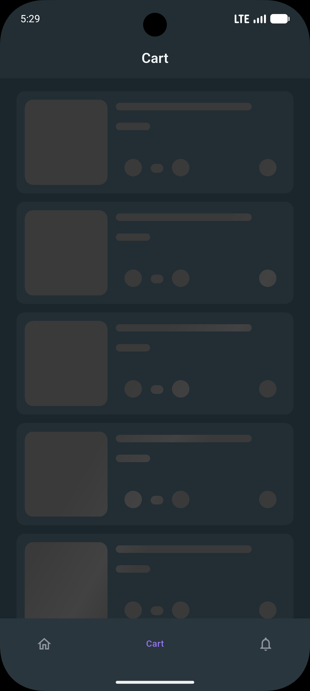
  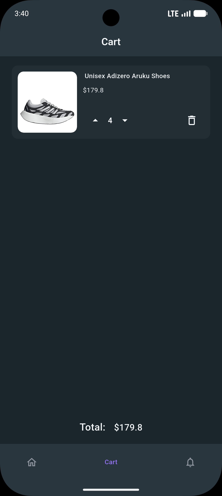
</div>

### Key Features Showcase

- **🎨 Beautiful UI Design** - Modern and clean interface with light and dark mode support
- **🌙 Dark Mode** - Seamless dark mode experience across all screens
- **🔐 Secure Authentication** - Email verification with OTP
- **📱 Responsive Layout** - Optimized for all screen sizes
- **🛍️ Complete Shopping Flow** - From browsing to product details and cart management
- **🛒 Shopping Cart** - Intuitive cart with quantity adjustment and real-time price updates
- **📄 Infinite Scroll Pagination** - Smooth and efficient product loading as you browse
- **✨ Skeleton Loading** - Elegant shimmer animations powered by Skeletonizer for products and cart during data loading

## 🔧 Configuration

### Environment Setup

The app uses environment-specific configurations:

- Development/Production API endpoints
- Secure token storage with automatic refresh capability
- Network timeout configurations
- JWT token management with refresh token rotation

### Security Features

#### Token Management

- **JWT Access Tokens**: Short-lived tokens for API authentication
- **Refresh Tokens**: Long-lived tokens for automatic token renewal
- **Secure Storage**: Encrypted local storage for sensitive authentication data
- **Automatic Cleanup**: Tokens are automatically cleared on authentication errors

#### Network Security

- **Request Interceptors**: Automatic token injection and validation
- **Error Handling**: Graceful handling of authentication failures
- **Token Rotation**: Secure refresh token rotation on each renewal
- **Session Persistence**: Maintains user sessions across app restarts

### Firebase Distribution & CI/CD

This project uses Fastlane for Firebase App Distribution. For security, Firebase tokens and app IDs are stored as environment variables.

#### Local Development Setup

1. **Copy environment template**:

   ```bash
   cp android/fastlane/.env.example .env
   ```

2. **Get Firebase CLI token**:

   ```bash
   # Install Firebase CLI if not already installed
   npm install -g firebase-tools

   # Login and get CI token
   firebase login:ci
   ```

   Copy the token from the output.

3. **Edit .env file**:

   ```bash
   # Open .env and set your values
   FIREBASE_APP_ID=1:766832833441:android:40e6a427aade9ea5fd91e0
   FIREBASE_CLI_TOKEN=your_token_from_firebase_login_ci
   ```

4. **Run Firebase distribution**:
   ```bash
   cd android/fastlane
   fastlane firebase_distribution
   ```

#### CI/CD Setup (GitHub Actions)

1. **Add repository secrets** in GitHub Settings > Secrets and variables > Actions:

   - `FIREBASE_APP_ID`: `1:766832833441:android:40e6a427aade9ea5fd91e0`
   - `FIREBASE_CLI_TOKEN`: Your Firebase CLI token from `firebase login:ci`
   - `GOOGLE_SERVICES_JSON`: Base64 encoded content of your original `android/app/google-services.json`

     To encode the file, run:

     ```bash
     # Linux/macOS
     base64 -w 0 android/app/google-services.json

     # Windows PowerShell
     [Convert]::ToBase64String([Text.Encoding]::UTF8.GetBytes((Get-Content "android/app/google-services.json" -Raw)))
     ```

2. **Create the workflow file** manually at `.github/workflows/firebase-distribution.yml`:

   ```bash
   # Copy the template workflow
   mkdir -p .github/workflows
   cp docs/workflows/firebase-distribution.yml .github/workflows/
   ```

   The workflow template is provided in `docs/workflows/firebase-distribution.yml` because GitHub's OAuth restrictions prevent automatic creation of workflow files.

3. **For local development**, you need to restore the google-services.json file:

   ```bash
   # Use the injection script to restore from your local backup
   export GOOGLE_SERVICES_JSON="your_base64_encoded_content"
   ./scripts/inject-google-services.sh

   # Or manually copy your backup file
   cp path/to/your/backup/google-services.json android/app/
   ```

#### Other CI Platforms

- **Azure DevOps**: Use variable groups or pipeline variables
- **GitLab CI**: Use project variables in Settings > CI/CD > Variables
- **Bitrise**: Use environment variables in workflow settings

### Assets

```
assets/
├── fonts/          # Custom fonts
└── images/         # App images and icons
    ├── Logo.png
    ├── loading.gif
    ├── sandy_loading.gif
    └── various UI elements
```

## 🛠️ Development

### Code Generation

Run the following command when you modify models or API services:

```bash
flutter packages pub run build_runner build --delete-conflicting-outputs
```

### Testing

```bash
flutter test
```

### Building for Production

```bash
# Android
flutter build apk --release

# iOS
flutter build ios --release
```

## 📄 License

This project is a private Flutter application for e-commerce purposes.

## 🤝 Contributing

This is a private project. For any questions or contributions, please contact the development team.

---

**Built with ❤️ using Flutter**
